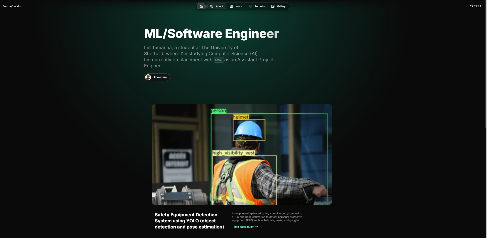

# **Tamanna Mishra – Developer Portfolio**

Showcasing my work as a software developer and AI engineer, built with [Once UI](https://once-ui.com) on [Next.js](https://nextjs.org). Designed to be clean, customizable, and scalable for personal use.



---

## 🚀 Viewing the website

You can learn more about me at https://tamannas-portfolio.vercel.app/ !

---

## ✨ Features

- ✅ Built with Once UI: Customizable components and design tokens
- 🧠 Smart SEO: Auto-generated metadata and Open Graph images
- 🖥️ Responsive Design: Works on all screen sizes
- Hosted using Vercel
- Developed using Vue.js.
---

## 👤 Author

**Tamanna Mishra**

Social links are available on the portfolio website.  
(Visit the "About" or footer section of the site.)

---

## 📄 License

This project is licensed under the **CC BY-NC 4.0 License**.

- 🔒 **Private use only** – commercial use is **not allowed**
- ✍️ Attribution: Selene Yu's template

See `LICENSE.txt` for full details.

```
